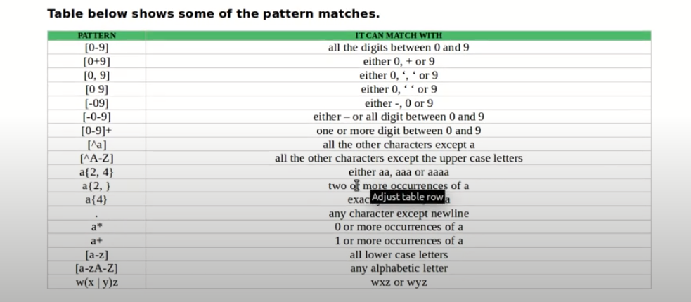

## FLEX Fast Lexical Analizer Generator 

The flex inp file consist of 3 sections, seperated by a line containing only %% 

the file extention is `.l` 

The file overall layout: 

``` 
definitioni // inluding libraries or declaring variables 
%% 
rules // defining rules 
%%
user code // main program and subrutine 
``` 

the syntax of definition is as follows: 
```
%{
// inlude lib or define a var 
}% 
```

table below shows some of the paterns matches: 

| Pattern |        it can match with       |
|:-------:|:------------------------------:|
|  [0-9]  | all the digits between 0 and 9 |
|  [0+9]  |        either 0, + or 9        |
|  [0,9]  |        either 0 ',' or 9       |
|  [0 9]  |       either 0 , ' ' or 9      |

 


## Creating a flex program 

Create a `.l` or `.flex` file

To compile:

`$ flex filename.flex` this will generate a `.c` file called `lex.yy.c` 

Compile and run the generated `.c` file to test the Lexical analyzer you created: 

```
$ gcc lex.yy.C -o ouput
$ ./output 
```


